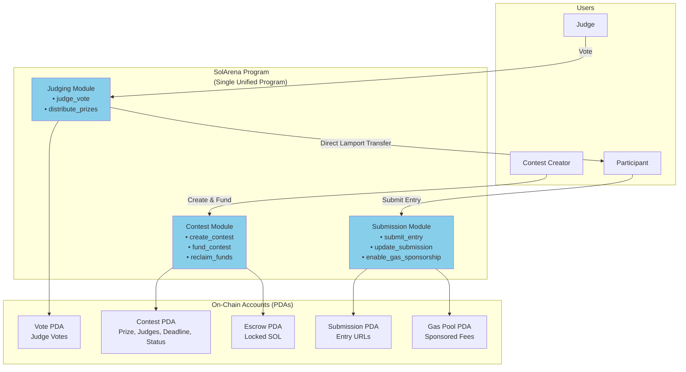
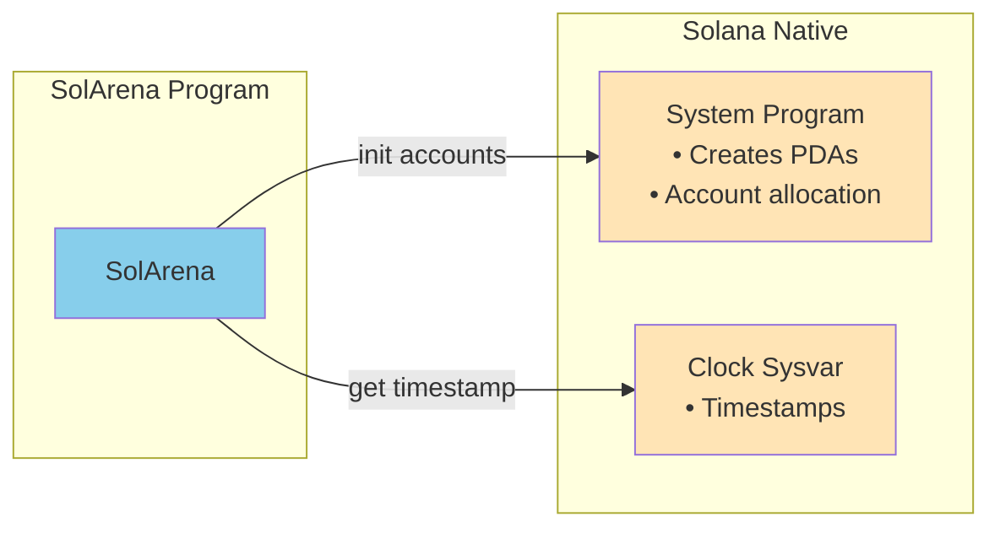
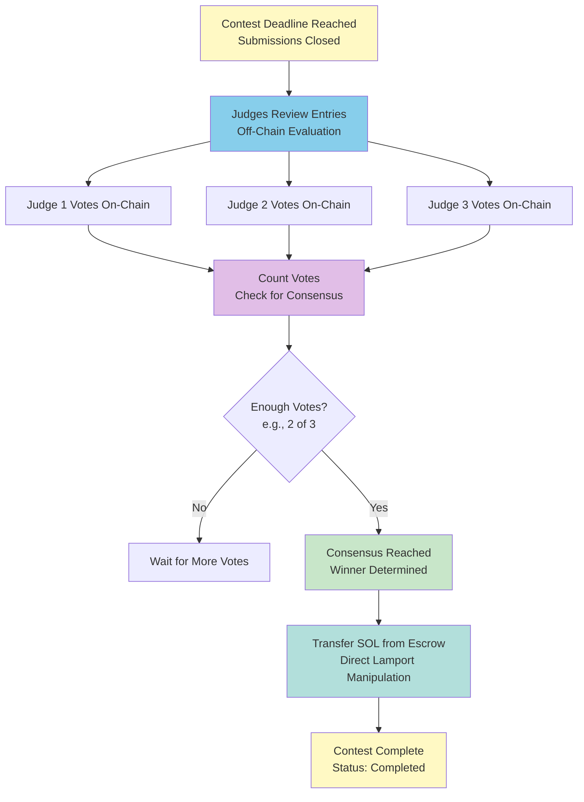
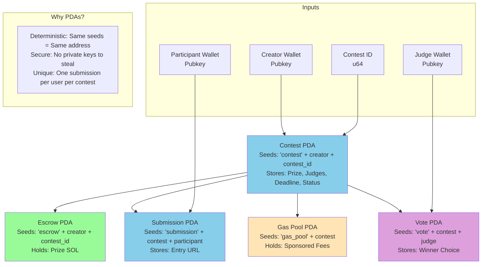
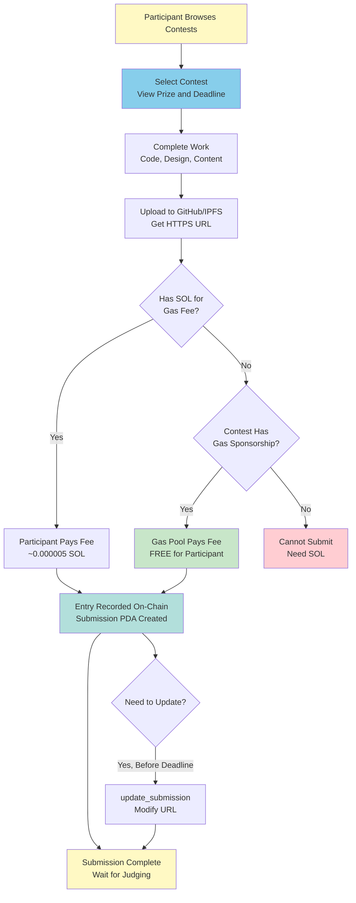
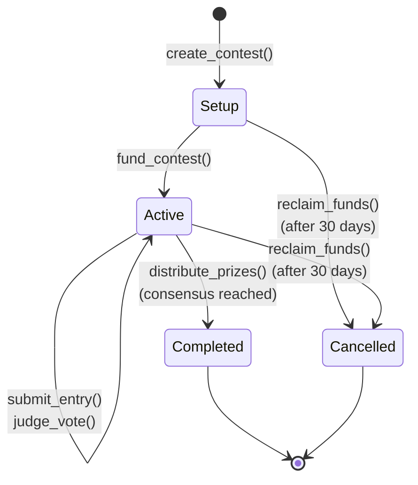

# SolArena Architecture Diagrams (Updated)

These diagrams reflect the actual implementation of the SolArena contest platform.

---

## 1. Main Architecture



---

## 2. System Interactions (No Oracle)



**Key Difference from Old Diagram:**
- **No Switchboard Oracle** - Prizes are stored in fixed SOL (lamports), not USD
- **Direct lamport transfers** - Prize distribution uses `try_borrow_mut_lamports()`, not System Program transfer CPI

---

## 3. Judging Flow



**Key Differences from Old Diagram:**
- **No Switchboard price query** - Prize is fixed in lamports
- **No price calculation** - Prize distributed as stored
- Votes counted dynamically from `remaining_accounts`

---

## 4. PDA Relationships



**Key Difference from Old Diagram:**
- **No Consensus PDA** - Votes are counted dynamically from individual Vote PDAs
- Added **Gas Pool PDA**

---

## 5. Participant Submission Flow



---

## 6. Contest Lifecycle State Machine



---

## 7. Account Data Structures

### Contest PDA
```
┌─────────────────────────────────┐
│ Contest Account (~853 bytes)    │
├─────────────────────────────────┤
│ creator: Pubkey (32)            │
│ contest_id: u64 (8)             │
│ title: String (max 100)         │
│ description: String (max 500)   │
│ prize_amount: u64 (8)           │
│ submission_deadline: i64 (8)    │
│ judges: Vec<Pubkey> (max 5)     │
│ approval_threshold: u8 (1)      │
│ status: ContestStatus (1)       │
│ submission_count: u32 (4)       │
│ created_at: i64 (8)             │
│ gas_sponsorship_enabled: bool   │
│ funded: bool (1)                │
│ bump: u8 (1)                    │
└─────────────────────────────────┘
```

### Submission PDA
```
┌─────────────────────────────────┐
│ Submission Account              │
├─────────────────────────────────┤
│ participant: Pubkey (32)        │
│ contest: Pubkey (32)            │
│ submission_url: String (max 200)│
│ submitted_at: i64 (8)           │
│ last_modified: i64 (8)          │
│ bump: u8 (1)                    │
└─────────────────────────────────┘
```

### Vote PDA
```
┌─────────────────────────────────┐
│ JudgeVoteAccount                │
├─────────────────────────────────┤
│ judge: Pubkey (32)              │
│ contest: Pubkey (32)            │
│ winner: Pubkey (32)             │
│ voted_at: i64 (8)               │
│ bump: u8 (1)                    │
└─────────────────────────────────┘
```

---

## Summary of Changes from Old Diagrams

| Old Diagram | What Changed |
|-------------|--------------|
| 3 Separate Programs | **1 Unified SolArena Program** |
| Switchboard Oracle for USD price | **No Oracle - Fixed SOL prizes** |
| System Program transfers | **Direct lamport manipulation** |
| Consensus PDA | **No Consensus PDA - Dynamic vote counting** |
| Implied gas sponsorship | **Explicit Gas Pool PDA** |

---

## How to Render These Diagrams

1. **Mermaid Live Editor**: https://mermaid.live
2. **VS Code**: Install "Mermaid Preview" extension
3. **GitHub**: Mermaid is natively supported in markdown
4. **Export to PNG/SVG**: Use Mermaid CLI or online tools
